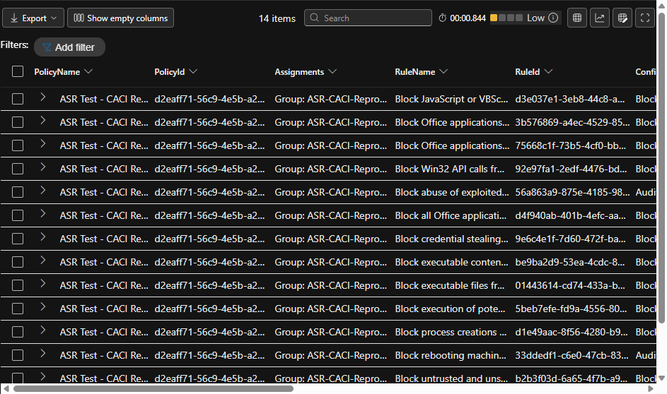

# Intune ASR Policy to MDE Event Correlation

Generates a ready-to-run Microsoft Defender Advanced Hunting query from the live Intune Attack Surface Reduction policy configuration.

## Quick start

GCC High:

```powershell
.\Export-IntuneAsrHuntingQuery.ps1 -Environment USGov -UseDeviceCode
```

Commercial:

```powershell
.\Export-IntuneAsrHuntingQuery.ps1 -UseDeviceCode
```

The script creates `Intune-ASR-Tracking.kql` in the current directory. Open Advanced Hunting, paste the file contents, and select **Run query**:

- GCC High: <https://security.microsoft.us/v2/advanced-hunting>
- Commercial: <https://security.microsoft.com/v2/advanced-hunting>

No tenant ID or output path is required for normal interactive use.

The PowerShell script reads deployed Endpoint Security **Attack Surface Reduction Rules** policies through Microsoft Graph and writes a `.kql` file containing:

- Intune policy name and ID
- Assignment names
- Canonical ASR rule name and GUID
- Configured mode (`Off`, `Block`, `Audit`, or `Warn`)
- MDE event and device counts
- First and last observed event
- Observed MDE `ActionType` values and device names
- Latest Defender Antivirus mode for devices that generated matching ASR events
- Configured rules with zero observed events

Run [`Defender-AV-Mode-Inventory.kql`](../Defender-AV-Mode-Inventory.kql) by itself for a current per-device inventory of Active, Passive, Disabled, EDR Blocked, and other reported states.

## Requirements

- PowerShell 7 or Windows PowerShell 5.1
- `Microsoft.Graph.Authentication` PowerShell module
- Delegated Microsoft Graph permissions:
  - `DeviceManagementConfiguration.Read.All`
  - `Group.Read.All`
- Access to Microsoft Defender Advanced Hunting to run the generated query

Install the authentication module when needed:

```powershell
Install-Module Microsoft.Graph.Authentication -Scope CurrentUser
```

## Commercial

```powershell
.\Export-IntuneAsrHuntingQuery.ps1 `
  -Environment Global `
  -TenantId '<tenant-id>' `
  -UseDeviceCode `
  -LookbackDays 30 `
  -OutputPath '.\Intune-ASR-Tracking.kql'
```

Paste the generated query into Microsoft Defender Advanced Hunting at `https://security.microsoft.com/v2/advanced-hunting`.

## GCC High

```powershell
.\Export-IntuneAsrHuntingQuery.ps1 `
  -Environment USGov `
  -TenantId '<gcc-high-tenant-id>' `
  -UseDeviceCode `
  -LookbackDays 30 `
  -OutputPath '.\Intune-ASR-Tracking.kql'
```

`USGov` selects the Microsoft Graph US Government environment, `https://login.microsoftonline.us`, and `https://graph.microsoft.us`.

## GCC High validation

Validated end to end in GCC High on **2026-09-16**:

- Authenticated through the `USGov` Microsoft Graph environment.
- Read one live Intune ASR policy with 14 configured rules and its assignment group.
- Generated the KQL file successfully.
- Ran that exact KQL in GCC High Defender Advanced Hunting, workspace `dibsecus`.
- Returned all 14 configured rule rows in 0.844 seconds with low query load.



## What the correlation means

MDE ASR events contain the canonical ASR rule GUID in `AdditionalFields.RuleId`, but they do not contain the originating Intune policy ID. The generated query therefore correlates observed events to every discovered Intune policy that configures the same rule GUID and displays that policy's assignments.

A zero event count means no matching ASR behavior was observed during the selected lookback. It does not prove that the rule was not deployed. Use Intune device and per-setting status for deployment confirmation.

`DefenderModes` and `DeviceModeDetails` describe only devices that generated a matching ASR event. `OverallDefenderModeCounts` shows compact tenant-wide counts from the latest seven days even when a configured rule has zero events. Use the standalone inventory for per-device details.

`AvMode` is contained in the `DeviceTvmInfoGathering.AdditionalFields` property bag, and Microsoft does not currently document its numeric values in the public table schema. The included mapping was validated against live tenant telemetry on 2026-09-16. Unknown future values remain visible as `Unknown (<code>)`, while absent values appear as `Not reported`.

If multiple policies or another management authority configure the same rule, compare `ConfiguredMode` with `ObservedActions`. For example, a policy configured for Audit alongside a `Blocked` event indicates another effective configuration source or overlapping policy should be investigated.
